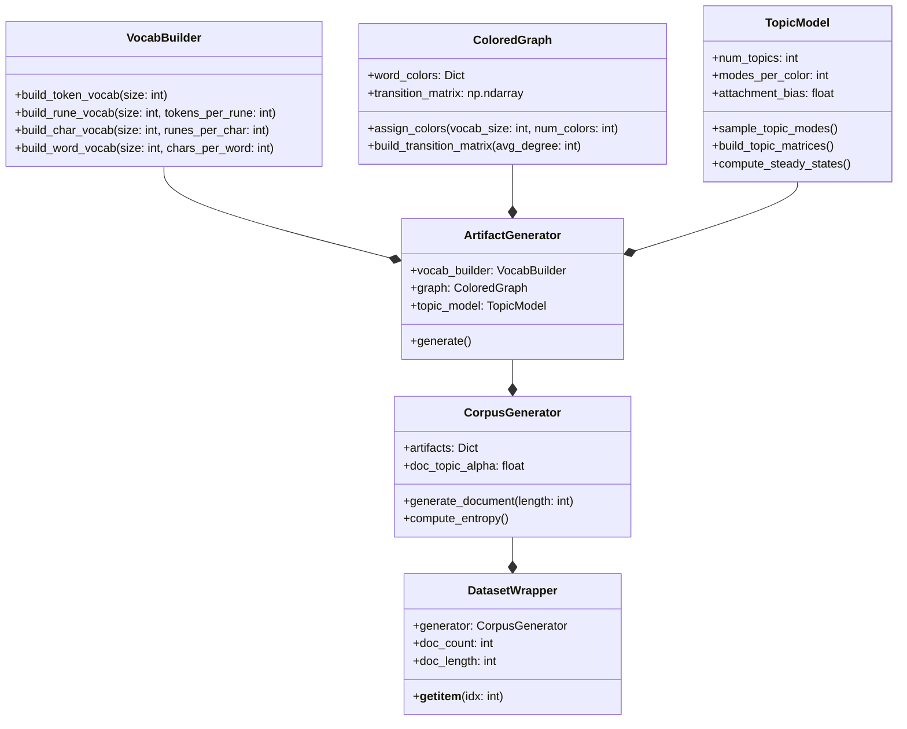
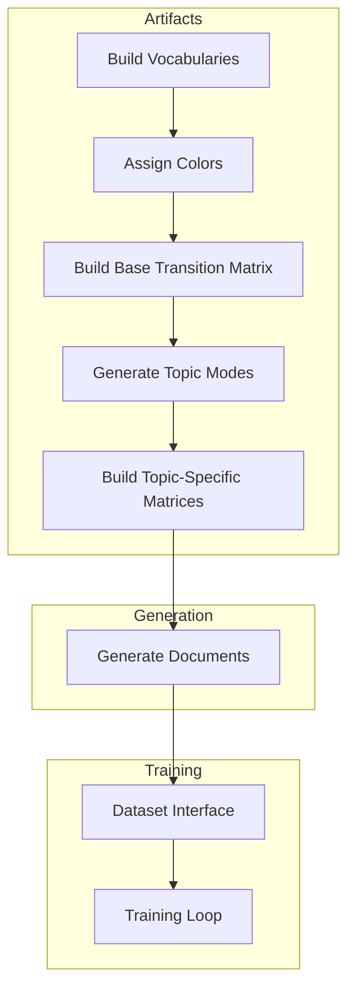

## classDiagram

```mermaid
classDiagram
    class VocabBuilder {
        +build_token_vocab(size: int)
        +build_rune_vocab(size: int, tokens_per_rune: int)
        +build_char_vocab(size: int, runes_per_char: int)
        +build_word_vocab(size: int, chars_per_word: int)
    }

    class ColoredGraph {
        +word_colors: Dict
        +transition_matrix: np.ndarray
        +assign_colors(vocab_size: int, num_colors: int)
        +build_transition_matrix(avg_degree: int)
    }

    class TopicModel {
        +num_topics: int
        +modes_per_color: int
        +attachment_bias: float
        +sample_topic_modes()
        +build_topic_matrices()
        +compute_steady_states()
    }

    class ArtifactGenerator {
        +vocab_builder: VocabBuilder
        +graph: ColoredGraph
        +topic_model: TopicModel
        +generate()
    }

    class CorpusGenerator {
        +artifacts: Dict
        +doc_topic_alpha: float
        +generate_document(length: int)
        +compute_entropy()
    }

    class DatasetWrapper {
        +generator: CorpusGenerator
        +doc_count: int
        +doc_length: int
        +__getitem__(idx: int)
    }

    VocabBuilder --* ArtifactGenerator
    ColoredGraph --* ArtifactGenerator
    TopicModel --* ArtifactGenerator
    ArtifactGenerator --* CorpusGenerator
    CorpusGenerator --* DatasetWrapper
```

## Flow diagram for document generation

```mermaid
    %% Flow diagram for document generation
    flowchart TD
        A[Build Vocabularies] --> B[Assign Colors]
        B --> C[Build Base Transition Matrix]
        C --> D[Generate Topic Modes]
        D --> E[Build Topic-Specific Matrices]
        E --> F[Generate Documents]
        F --> G[Dataset Interface]
        G --> H[Training Loop]
        
        subgraph Artifacts
        A
        B
        C
        D
        E
        end
        
        subgraph Generation
        F
        end
        
        subgraph Training
        G
        H
        end
```
