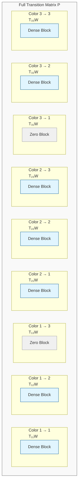
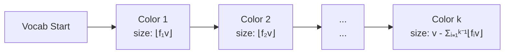
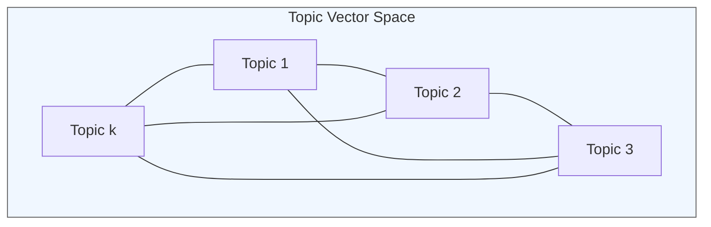
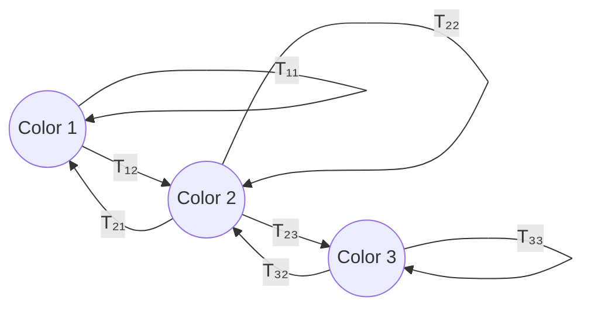

# Mathematical Appendix

[Previous sections remain the same...]

## 6. Information-Theoretic Analysis

### 6.1 Entropy Decomposition

The total entropy of generated sequences can be decomposed into several components:

1. **Transition Entropy**:
   ```
   H(transitions) = -Σᵢ Σⱼ Pᵢⱼ log Pᵢⱼ
   ```
   - Measures uncertainty in next-token prediction
   - Upper bounded by log(vocab_size)
   - Modified by temperature parameter τ

2. **Color-Level Entropy**:
   ```
   H(colors) = -Σᵢ Σⱼ P(cᵢ→cⱼ) log P(cᵢ→cⱼ)
   ```
   - Coarser-grained than transition entropy
   - Determined by color transition matrix
   - Lower bound on sequence entropy

3. **Topic Mixture Entropy**:
   ```
   H(topics) = -Σᵢ λᵢ log λᵢ
   ```
   - Measures diversity in topic usage
   - Independent of temperature
   - Affects global token distribution

### 6.2 Mutual Information Structure

The generated sequences exhibit several important mutual information relationships:

1. **Topics and Colors**: I(T;C)
   ```mermaid
   graph LR
       T((Topics)) --> C((Colors))
       T --> K((Tokens))
       C --> K
   ```
   - Topics influence color transitions
   - Color constraints modify topic effects
   - I(T;C) ≤ min(H(T), H(C))

2. **Sequential Dependencies**:
   ```
   I(Xₜ; Xₜ₊ₖ) = H(Xₜ₊ₖ) - H(Xₜ₊ₖ|Xₜ)
   ```
   - Decays with distance k
   - Modified by color constraints
   - Bounded by transition entropy

### 6.3 Temperature Effects on Entropy

Temperature τ modifies the entropy structure:

1. **Low Temperature** (τ → 0):
   - H(transitions) → 0
   - Deterministic paths
   - I(Xₜ; Xₜ₊₁) → H(Xₜ)

2. **High Temperature** (τ → ∞):
   - H(transitions) → log(allowed_transitions)
   - Maximum entropy within constraints
   - I(Xₜ; Xₜ₊₁) → 0

3. **Optimal Temperature**:
   - Balances exploration and structure
   - Preserves topic influence
   - Maintains color constraints

### 6.4 Entropy Bounds

Several important bounds constrain the entropy:

1. **Lower Bound**:
   ```
   H(sequence) ≥ max(H(colors), H(topics))
   ```
   - Cannot generate less entropy than constraints

2. **Upper Bound**:
   ```
   H(sequence) ≤ min(log(vocab_size), H(colors) + H(topics))
   ```
   - Limited by vocabulary size
   - Limited by combined constraints

3. **Mutual Information Bounds**:
   ```
   I(tokens; topics) ≤ min(H(tokens), H(topics))
   I(tokens; colors) ≤ min(H(tokens), H(colors))
   ```
   - Information processing inequalities
   - Modified by temperature

### 6.5 Rate-Distortion Analysis

The system exhibits a rate-distortion tradeoff:

1. **Rate**: Information content of sequences
   ```
   R(τ) = H(sequence|τ)
   ```

2. **Distortion**: Deviation from target distribution
   ```
   D(τ) = KL(P_target || P_generated)
   ```

3. **Optimal Temperature**:
   ```
   τ* = argmin_τ [D(τ) + βR(τ)]
   ```
   where β controls the rate-distortion tradeoff# Mathematical Appendix

## 1. Matrix Structure Visualizations

### 1.1 Block Structure of Transition Matrix



Each block represents transitions between color classes. Zero blocks (grayed out) show forbidden transitions.

## 2. Property Proofs

### 2.1 Orthonormality Preservation

**Theorem 1:** The base transition matrix M = QΛQᵀ preserves probability structure when Q is orthonormal and Λ is diagonal with Σᵢλᵢ = 1.

**Proof:**
1. Row sums of M:
   ```
   Σⱼ Mᵢⱼ = Σⱼ (QΛQᵀ)ᵢⱼ
           = Σⱼ Σₖ qᵢₖλₖqⱼₖ
           = Σₖ λₖ(qᵢₖΣⱼqⱼₖ)
           = Σₖ λₖqᵢₖ · 0     (orthonormality of Q)
           = 1
   ```

2. Non-negativity is ensured by the ReLU operation before normalization.

### 2.2 Topic Mixture Preservation

**Theorem 2:** Expected token frequencies in generated sequences reflect the topic mixture weights.

**Proof:**
Let πₜ be the stationary distribution of P. Then:
1. πₜP = πₜ
2. For topic mixture λ:
   ```
   E[token_freq] ∝ Σᵢ λᵢqᵢ
   ```
3. This proportionality is maintained through the color constraints due to the block structure and normalization.

## 3. Structural Properties

### 3.1 Color Block Sizes

For vocabulary size v and color fractions f = [f₁, ..., fₖ]:



### 3.2 Topic Vector Structure

Topic vectors form an orthonormal basis in ℝᵛ:



Each vector qᵢ:
- Has unit norm: ||qᵢ||₂ = 1
- Is orthogonal to all other topics: qᵢᵀqⱼ = 0, i ≠ j
- Spans a dimension in token probability space

## 4. Sampling Properties

### 4.1 Temperature Effects

Temperature τ modifies transition probabilities:
```
P(τ) = normalize(ReLU(M/τ) ⊙ W)
```

Effects:
- τ → 0: Approaches deterministic transitions
- τ → ∞: Approaches uniform distribution over allowed transitions
- τ = 1: Raw topic-induced probabilities

### 4.2 Color Transition Dynamics

Given color transition matrix T:


Long-term color frequencies depend on:
1. Transition matrix structure
2. Topic mixture weights
3. Block sizes from color fractions

## 5. Statistical Properties

### 5.1 Entropy Analysis

For a transition matrix P, the entropy of transitions from state i is:
```
H(i) = -Σⱼ Pᵢⱼ log Pᵢⱼ
```

This leads to bounds on sequence entropy:
```
H_min ≤ H(sequence) ≤ min(H_color + H_topic, log(v))
```
where:
- H_min depends on color constraints
- H_color is entropy from color transitions
- H_topic is entropy from topic mixture
